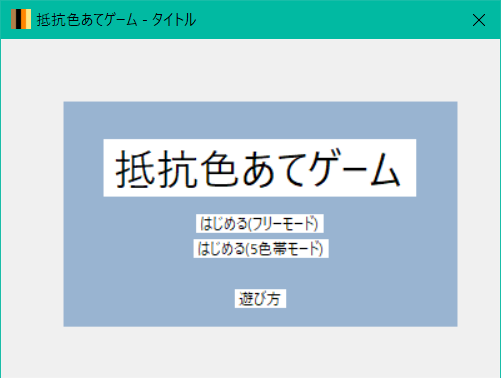
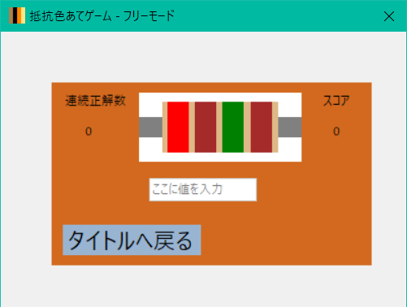
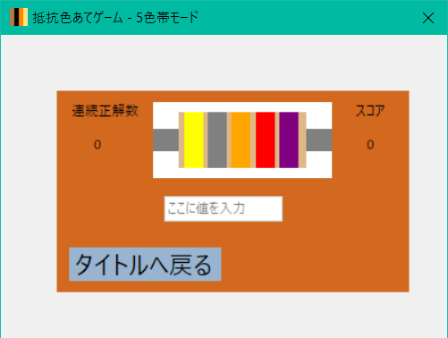

# Resister_Game

ランダムに常時される抵抗器の値を読み当てるアプリ

# フォーム画像

起動して最初に表示される画像

抵抗色当てゲーム - フリーモード - 

抵抗色当てゲーム - 5本線モード - 

### 以下 遊び方 より引用

*"ランダムに変わる抵抗の帯に対応した値を入力しよう!"*

*"入力した後にEnterを押して正解を確認しよう!"*

*"正解するとスコアが加算されるよ!"*

*"目指せスコア1万点!"*

